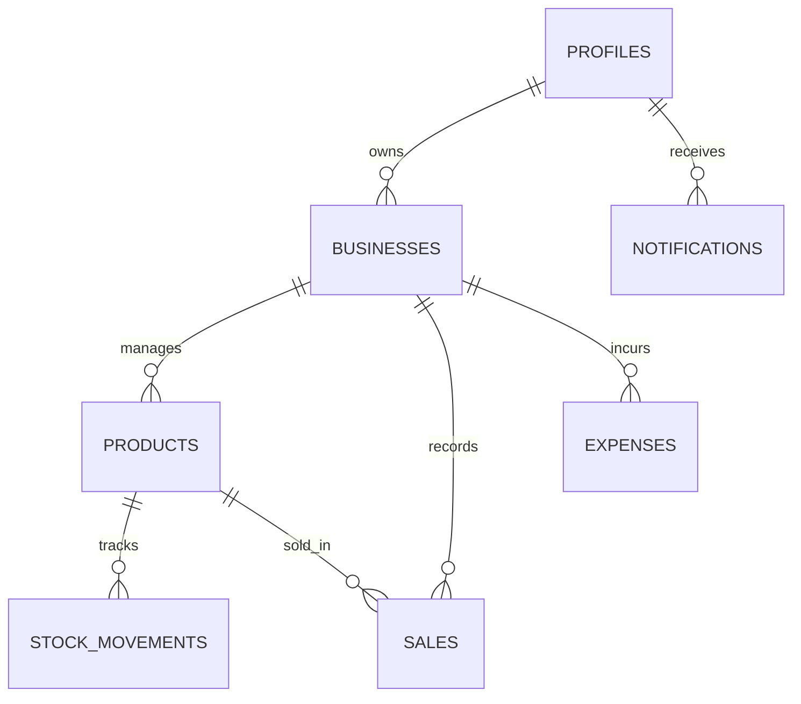

# Supabase Database Schema Implementation Plan

This document outlines the specific Supabase tables, columns, and relationships required to make the Hisab (Pharmacy Management System) functional.

## 1. Core Tables

### `profiles`
Extends the default `auth.users` table with additional business owner details.
| Column | Data Type | Notes |
| :--- | :--- | :--- |
| `id` | `uuid` | Primary Key (links to `auth.users.id`) |
| `full_name` | `text` | |
| `email` | `text` | |
| `phone` | `text` | |
| `address` | `text` | |
| `created_at` | `timestamptz` | Default: `now()` |

### `businesses`
Stores information about the different pharmacies or businesses managed by a user.
| Column | Data Type | Notes |
| :--- | :--- | :--- |
| `id` | `uuid` | Primary Key |
| `owner_id` | `uuid` | Foreign Key -> `profiles.id` |
| `name` | `text` | |
| `type` | `text` | e.g., 'retail', 'pharmacy' |
| `currency` | `text` | Default: 'BDT' |
| `address` | `text` | |
| `created_at` | `timestamptz` | Default: `now()` |

---

## 2. Inventory & Products

### `products`
The core catalog of medicines and items.
| Column | Data Type | Notes |
| :--- | :--- | :--- |
| `id` | `uuid` | Primary Key |
| `business_id` | `uuid` | Foreign Key -> `businesses.id` |
| `name` | `text` | |
| `sku` | `text` | Stock Keeping Unit |
| `category` | `text` | |
| `buy_price` | `numeric` | |
| `sell_price` | `numeric` | |
| `current_stock` | `integer` | |
| `min_stock_level`| `integer` | Alert threshold |
| `supplier_name` | `text` | Optional |
| `supplier_phone`| `text` | Optional |
| `created_at` | `timestamptz` | |

### `stock_movements`
Audit trail for inventory changes (Sales, Restocks, Manual adjustments).
| Column | Data Type | Notes |
| :--- | :--- | :--- |
| `id` | `uuid` | Primary Key |
| `product_id` | `uuid` | Foreign Key -> `products.id` |
| `type` | `text` | 'sale', 'restock', 'manual' |
| `quantity_change`| `integer` | Positive for restock, negative for sale |
| `remaining_stock`| `integer` | Stock after movement |
| `notes` | `text` | |
| `created_at` | `timestamptz` | |

---

## 3. Financials

### `sales`
Records of all customer transactions.
| Column | Data Type | Notes |
| :--- | :--- | :--- |
| `id` | `uuid` | Primary Key |
| `business_id` | `uuid` | Foreign Key -> `businesses.id` |
| `product_id` | `uuid` | Foreign Key -> `products.id` |
| `quantity` | `integer` | |
| `sell_price` | `numeric` | Price at time of sale |
| `total_amount` | `numeric` | |
| `profit` | `numeric` | |
| `payment_method`| `text` | 'cash', 'bkash', 'nagad', 'card' |
| `customer_name` | `text` | |
| `status` | `text` | 'Completed', 'Pending', 'Refunded' |
| `created_at` | `timestamptz` | |

### `expenses`
Records of business operational costs.
| Column | Data Type | Notes |
| :--- | :--- | :--- |
| `id` | `uuid` | Primary Key |
| `business_id` | `uuid` | Foreign Key -> `businesses.id` |
| `category` | `text` | e.g., 'rent', 'utilities', 'salary' |
| `amount` | `numeric` | |
| `description` | `text` | |
| `date` | `date` | |
| `created_at` | `timestamptz` | |

---

## 4. Utility

### `notifications`
User alerts for low stock or system updates.
| Column | Data Type | Notes |
| :--- | :--- | :--- |
| `id` | `uuid` | Primary Key |
| `user_id` | `uuid` | Foreign Key -> `profiles.id` |
| `title` | `text` | |
| `message` | `text` | |
| `type` | `text` | 'info', 'warning', 'danger' |
| `read` | `boolean` | Default: `false` |
| `created_at` | `timestamptz` | |

## Summary of Relationships

> [!IMPORTANT]
> **Row Level Security (RLS)**: You should enable RLS on all tables. 
> Ensure users can only see data where `owner_id` or `business_id` (via business link) matches their own UUID.
